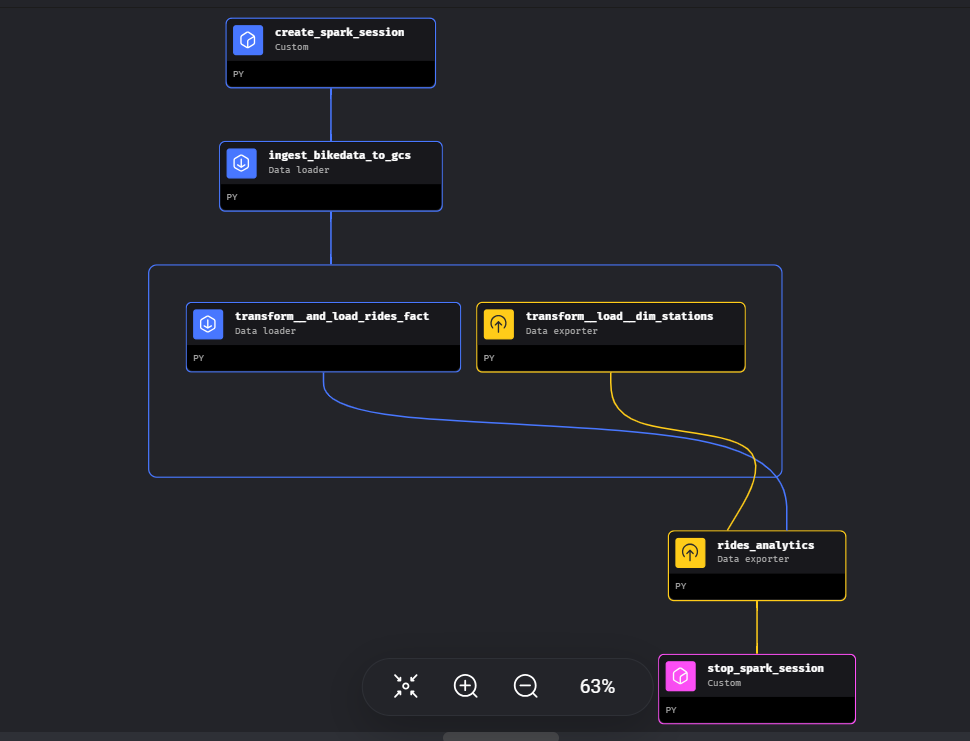

# Bike usage analytics project

- [Project Description](#project-description)

- [Prerequisites](#prerequisites)

- [Setup and Reproducibility](#Setup-and-Reproducibility)

- [Running the Code](#running-the-code)

- [Creating Visualisations](#creating-visualisations) 


## Project Description

This project aims to build an end-to-end data engineering pipeline for processing and analyzing data from the [MiBici](https://www.mibici.net/es/datos-abiertos/) public bicycle system in the Guadalajara Metropolitan Area. The pipeline developed using [Mage](https://docs.mage.ai/introduction/overview) involves downloading open data from the MiBici website, storing it in a Google Cloud Storage ( ([GCS](https://cloud.google.com/)) bucket, transforming the data using [Apache Spark](https://spark.apache.org/docs/2.1.0/api/python/index.html), and loading it into Google [BigQuery](https://cloud.google.com/bigquery/) for visualization and analysis.

The project was developed as the final assignment for the [Data Engineering Zoomcamp](https://github.com/DataTalksClub/data-engineering-zoomcamp#data-engineering-zoomcamp) in the 2024 Cohort.

The application fetches data from the [MiBici](https://www.mibici.net/es/datos-abiertos/). from 2020 .

  

**Pipeline description:**

The Pipelines are orchestrated via  [Mage](https://docs.mage.ai/introduction/overview)

- Pipeline fetches the data from APIs

- Then it transforms both data sets and uploads them to Google Cloud Storage.

- In the next step this data is loaded from GCS into BigQuery.

- from BigQuery dataset we analyzing and visualizing bicycle usage patterns and trends using Tableau or other visualization tools..


---

## Prerequisites


Before running the data engineering pipeline, ensure you have:

- [Docker](https://docs.docker.com/engine/install/)

- [Git](https://git-scm.com/book/en/v2/Getting-Started-Installing-Git)

- [Terraform](https://developer.hashicorp.com/terraform/install)

- [Google Cloud SDK](https://cloud.google.com/sdk/docs/install)

- [Git](https://git-scm.com/book/en/v2/Getting-Started-Installing-Git)

- [VS Code](https://code.visualstudio.com/download) with the [Remote - SSH](https://marketplace.visualstudio.com/items?itemName=ms-vscode-remote.remote-ssh) extension installed
  
- Setup a GCP account

To run the code you need to follow the steps below.

---

##   Setup and Reproducibility

*Note: these instructions are used for Linux/WSL.

### 1. Clone the Repository
	
		git clone https://github.com/Javeed-Pasha/Bike-usage-analytics-project  Bike-usage-analytics-project/
	
### 2. Install and Initialize Terraform
	
		sudo apt update && sudo apt install terraform 
		terraform init
	
### 3. Create and download service account key

Create [Service Account key](https://cloud.google.com/iam/docs/keys-create-delete)

ensure the service account key as following permissions.

`BigQuery Admin,Cloud Run Developer,Cloud SQL Admin,Compute Admin,Service Account Token Creator,Storage Admin`

download the service account key and save as `my-creds.json` and save it in your local machine under `~/.gc/` directory. This key file will be used to authenticate requests to GCP services

### 4. Install and initialize google cloud SDK
	
		sudo apt-get update && sudo apt-get install google-cloud-sdk
		gcloud init
	
	
### 5. Set Google Application Credentials
	
		export GOOGLE_APPLICATION_CREDENTIALS=~/.gc/my-creds.json 
		gcloud auth activate-service-account --key-file $GOOGLE_APPLICATION_CREDENTIALS
	
	
### 6. Create SSH Key
	
		ssh-keygen -t rsa -f ~/.ssh/gcp_key -C gcp -b 2048
  
Note that in this context, "gcp_key" refers to the filename of the SSH key, while "gcp" represents the username. This user credential will be utilized for logging into the newly created GCP VM in the subsequent steps
		
### 7. Update Terraform Configuration
In the Terrafom files cloned in previous step go to varaibles.tf 

 -   In **variables.tf**:
		1. If the SSH key uses a different username, adjust VM_USER_HOME to /home/USERNAME in the Terraform file, replacing "USERNAME" with your chosen username.
		2. Set project to your GCP project ID.
		3. Set bq_dataset to your BigQuery dataset name.
		4. Set gcs_bucketname to your GCP bucket name.
      
 -  In **main.tf**:
     1. If the username is "gcp", no changes are required.
     2.  Replace `ssh-keys = "gcp:${file("~/.ssh/gcp_key.pub")}"` with `ssh-keys = "<USERNAME>:${file("~/.ssh/KEYFILENAME.pub")}"`
        , replacing <USERNAME> with your chosen username and KEYFILENAME with the filename from step 6 of the SSH key generation process.


### 8. Deploy Infrastructure
The Terraform scripts provisions a Google Cloud Platform (GCP) virtual machine (VM) and fetches this [Mage git repository](https://github.com/Javeed-Pasha/mage_dataengineeringzoomcamp), which contains the Mage data pipeline to extract the MiBici data into GCS bucket and into BigQuery warehouse.

**IMPORTANT**: The only thing that can **fail** in terraform apply are due to gcp bucket name  and bigquery dataset name conflicts. 
In case the creation of the GCP bucket and BigQuery dataset fails during the Terraform execution due to name conflicts,you'll need to choose new names and rerun the terraform plan and terraform apply steps.. 
	
	terraform init
	terraform plan
	terraform apply
	
 
	
### 9. Use VSCode Remote SSH Extension
- Connect to your new GCP VM using VS Code with the Remote - SSH extension.
- Enter the SSH connection details for GCP VM.

	
### 10. Update File Ownership and add the user to docker group 
	
	sudo chown -R $USER:$USER ~/mage
	sudo usermod -a -G docker $USER
	
	 
### 11. temporarily switch to docker  so that you dont get  permissions issue
	
		newgrp docker
	
	
### 12.  Copy Service Account Key
Manually Copy your service account key json contents created in step 3 to  ~/mage/my-creds.json on new GCP VM .
			
### Running the Code

-	To begin, navigate to the directory `cd ~/mage` in your terminal.Next, ensure that Docker containers are running. If not, start them by executing docker-compose up -d 
-	Ensure that you configure port forwarding in VS Code for ports 6789 and 5432.
-	Now, you can access the Mage application at http://localhost:6789/.
-	Modify the **create_spark_session** block within the **DataPipeline_mibici** pipeline. Replace the variables listed below with the variables defined in step 7(1).
   
		bucket_name='REPLACE_WITH_GCP_BUCKETNAME'
		project_id = 'REPLACE_WITH_GCP_PROJECT_ID'
		bigquery_dataset = 'REPLACE_WITH_BIGQUERY_DATASETNAME'
-	Finally,execute the pipeline named **DataPipeline_mibici**. Navigate to the triggers section and click `RUN@ONCE` to run the pipeline once.
 
Your pipeline should look like this:
   


Once the process is complete, the raw  csv data for rides will be _partitioned_ by _year_ and _month_ and stored  as parquet files in Google Cloud Storage under the directory as shown in  picture below .
```
zoomcamp/
└── bikesdataset/
    └── raw/
        ├── rides/
        │   ├── year=2021/
        │   │   └── month=1/
        │   │       └── ...
        │   ├── year=2021/
        │   │   └── month=2/
        │   │       └── ...
        │   └── ...
        └── nomenclature/
            └── ...
```
And in BigQuery, you will find a Dimension table named **Dim_Stations**, a Fact table called **Rides_Fact**, and an Analytics table named **rides-analytics**. 
The analytics table will contain metrics such as ride routes to identify popular routes.
 
<br>

<br>

  

## Creating Visualisations					 

  

- Log in to [Google looker studio](https://lookerstudio.google.com/navigation/reporting)

- Connect your dataset using the Big Query Connector

- Select your project name and the dataset. This would launch a dashboard page

- Create your visualizations and share.

  

<br>


<br >


[Go to Top](#Bike-usage-analytics-project)
